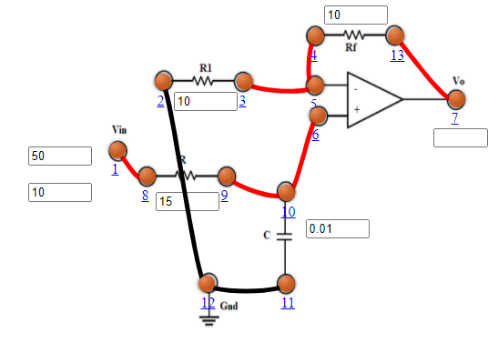
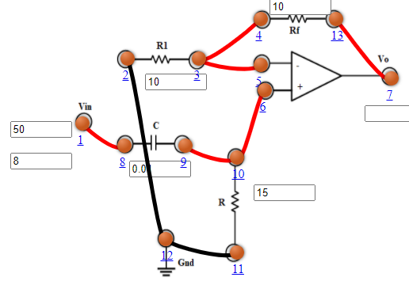
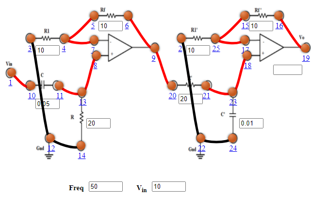

## Procedure

- **Active Low Pass Filter**
1. Connect the components as mentioned below:
L1-L8, L3-L4 or L4-L5, L3-L5, L6-L10 or L6-L9, L9-L10, L7-L13, L2-L12, L11-L12.(For eg. click on 1 and then drag to 8 and so on.)
2. Click on 'Check Connection' button to check the connections.
3. If connected wrong, click on the wrong connection. Else click on 'Delete all connection' button to erase all the connections.
4. Set Resistance(R1)=10 KΩ.
5. Set Resistance(Rf)=10 KΩ.
6. Set Resistance(R)=15 KΩ.
7. Set Capacitor(C)=0.01 µF.
8. The source voltage (Vin) is set to 10V.
9. Keeping source voltage constant, vary the frequency from 50 Hz in regular steps.
10. Click on "Add to Table" button to add the readings to the table.
11. Vary the Frequency by keeping the resistances and capacitance constant.
12. Select "Plot" button to plot the frequency graph or the phase graph of the RC frequency, Frequency(Hz) along X-axis and Magnitude along Y-axis.
13. Click on "Clear" button to take another set of readings.

Figure 1

- **Active High Pass Filter**
1. Connect the components as mentioned below:
L1-L8, L3-L4 or L4-L5, L3-L5, L6-L10 or L6-L9, L9-L10, L7-L13, L2-L12, L11-L12.(For eg. click on 1 and then drag to 8 and so on.)
2. Click on 'Check Connection' button to check the connections.
3. If connected wrong, click on the wrong connection. Else click on 'Delete all connection' button to erase all the connections.
4. Set Resistance(R1)=10 KΩ.
5. Set Resistance(Rf)=10 KΩ.
6. Set Resistance(R)=15 KΩ.
7. Set Capacitor(C)=0.01 µF.
8. The source voltage (Vin) is set to 10V.
9. Keeping source voltage constant, vary the frequency from 50 Hz in regular steps.
10. Click on "Add to Table" button to add the readings to the table.
11. Vary the Frequency by keeping the resistances and capacitance constant.
12. Select "Plot" button to plot the frequency graph or the phase graph of the RC frequency, Frequency(Hz) along X-axis and Magnitude along Y-axis.
13. Click on "Clear" button to take another set of readings.

Figure 1

- **Active Band Pass Filter**
1. Connect the components as mentioned below:
L1-L10, L3-L12, L12-L14, L11-L13, L8-L13 or L8-L11, L4-L7, L4-L5 or L5-L7, L6-L9, L9-L20, L2-L22, L22-L24, L21-L23, L18-L23 or L21-L18, L25-L17, L25-L15 or L15-L17, L16-L19.(For eg. click on 1 and then drag to 8 and so on.)
2. Click on 'Check Connection' button to check the connections.
3. If connected wrong, click on the wrong connection. Else click on 'Delete all connection' button to erase all the connections.
4. Set Resistance(R1 and R'1)=10 KΩ.
5. Set Resistance(Rf and R'f)=10 KΩ.
6. Set Resistance(R)=20 KΩ.
7. Set Capacitor(C)=0.05 µF.
8. Set Resistance(R')=20 KΩ.
9. Set Capacitor(C')=0.01 µF.
10. The source voltage (Vin) is set to 10V.
11. Keeping source voltage constant, vary the frequency from 50 Hz in regular steps.
12. Click on "Add to Table" button to add the readings to the table.
13. Vary the Frequency by keeping the resistances and capacitance constant.
14. Select "Plot" button to plot the frequency graph or the phase graph of the RC frequency, Frequency(Hz) along X-axis and Magnitude along Y-axis.
15. Click on "Clear" button to take another set of readings.

Figure 1

