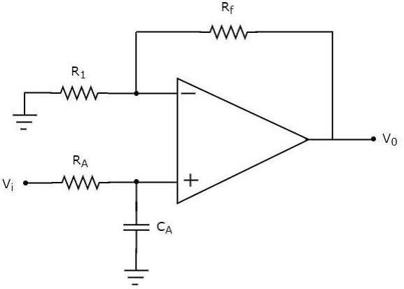
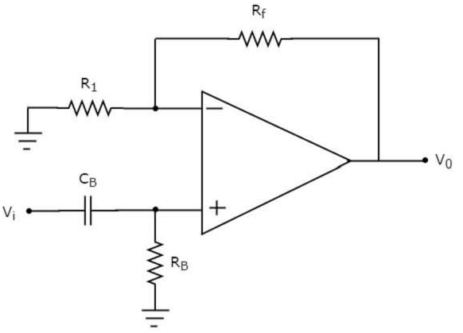
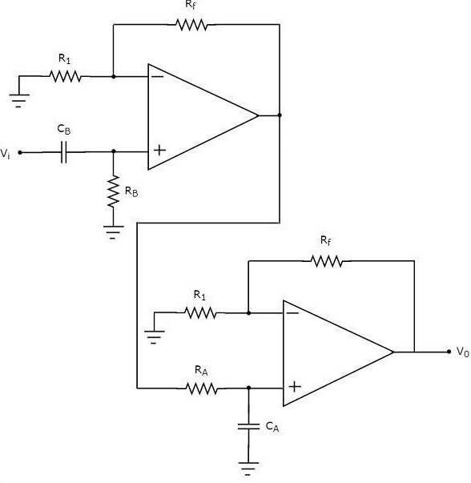

## Theory

Filters are electronic circuits that allow certain frequency components and / or reject some other. They are passive and are the electric circuits or networks that consist of passive elements like resistor, capacitor, and (or) an inductor. In this experiment active filters will be explained in detail.

#### Types of Active Filters

Active filters are the electronic circuits, which consist of active element like op-amp(s) along with passive elements like resistor(s) and capacitor(s). Active filters are mainly classified into four types based on the band of frequencies that they are allowing and / or rejecting. The four types of active filters are as follows-
- Active Low Pass Filter
- Active High Pass Filter
- Active Band Pass Filter
- Active Band Stop Filter

#### Active Low Pass Filter

If an active filter allows or passes only low frequency components and rejects or blocks all other high frequency components, then it is called as an active low pass filter. The circuit diagram of an active low pass filter is shown in the following figure −

Figure 1

The electric network, which is connected to the non-inverting terminal of an op-amp is a passive low pass filter. So, the input of a non-inverting terminal of an opamp is the output of a passive low pass filter. The above circuit resembles a non-inverting amplifier. It is having the output of a passive low pass filter as an input to the non-inverting terminal of op-amp. Hence, it produces an output, which is (1+Rf/R1) times the input present at the non-inverting terminal.

$$ \frac{V_o}{V_i}= \frac{A_f}{\sqrt{1+(\frac{f}{f_h})^2}} $$   

 where, \(A_f=(1+\frac{R_f}{R_1})\) 
 \(f_h=\frac{1}{2 \times \pi \times R_A \times C_A}\)

 Phase angle  (\(\phi\))  
&nbsp; $$ \phi = - atan(\frac{f}{f_h}) $$ 

We can choose the values of \(R_f\) and \(R_1\) suitably in order to obtain the desired gain at the output. Suppose, if we consider the resistance values of \(R_f\) and \(R_1\) as zero ohms and infinity ohms, then the above circuit will produce a unity gain low pass filter output.

#### Active High Pass Filter

f an active filter allows (passes) only high frequency components and rejects (blocks) all other low frequency components, then it is called an active high pass filter.
The circuit diagram of an active high pass filter is shown in the following figure −

Figure 1

The electric network, which is connected to the non-inverting terminal of an op-amp is a passive high pass filter. So, the input of a non-inverting terminal of opamp is the output of passive high pass filter. The above circuit resembles a non-inverting amplifier. It is having the output of a passive high pass filter as an input to non-inverting terminal of op-amp. Hence, it produces an output, which is (1+\(\frac{R_f}{R_1}\))  times the input present at its non-inverting terminal.

 &nbsp; $$ \frac{V_o}{V_i}= \frac{A_f \times \frac{f}{f_l}}{\sqrt{1+(\frac{f}{f_l})^2}} $$  
 where, \(A_f=(1+\frac{R_f}{R_1})\) 
 \(f_l=\frac{1}{2 \times \pi \times R_B \times C_B}\)
  
Phase angle  (\(\phi\))  
&nbsp;$$ \phi = atan(\frac{f}{f_l}) $$  
We can choose the values of \(R_f\) and \(R_1\) suitably in order to obtain the desired gain at the output. 
Suppose, if we consider the resistance values of \(R_f\) and \(R_1\) as zero ohms and infinity ohms, then the above circuit will produce a unity gain high pass filter output.   

#### Active Band Pass Filter

If an active filter allows (passes) only one band of frequencies, then it is called as an active band pass filter. In general, this frequency band lies between low frequency range and high frequency range. So, active band pass filter rejects (blocks) both low and high frequency components. The circuit diagram of an active band pass filter is shown in the following figure −

Figure 1

There are two parts in the circuit diagram of active band pass filter: The first part is an active high pass filter, while the second part is an active low pass filter. The output of the active high pass filter is applied as an input of the active low pass filter.That means, both active high pass filter and active low pass filter are cascaded in order to obtain the output in such a way that it contains only a particular band of frequencies.  
The active high pass filter, which is present at the first stage allows the frequencies that are greater than the lower cut-off frequency of the active band pass filter. So, we have to choose the values of \(R_B\) and \(C_B\) suitably, to obtain the desired lower cut-off frequency of the active band pass filter.  
Similarly, the active low pass filter, which is present at the second stage allows the frequencies that are smaller than the higher cut-off frequency of the active band pass filter. So, we have to choose the values of \(R_A\) and \(C_A\) suitably in order to obtain the desired higher cut-off frequency of the active band pass filter. Hence, the circuit in the diagram discussed above will produce an active band pass filter output.

